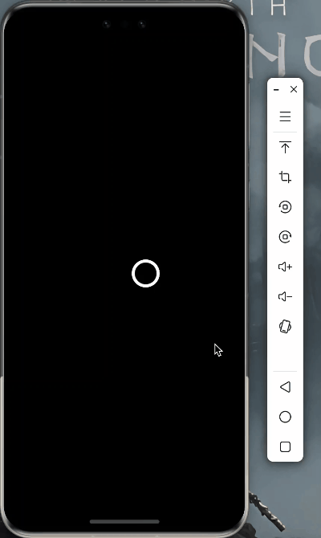
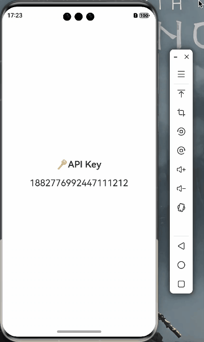

# ArkUI-Animations

HarmonyOS NEXT ArkUI Tutorials by LIZHIWEI

## Introduction

All demos in this repo were written by ArkTS and ArkUI. The only purpose of this repo I created is just for learning ArkUI and sharing what I learned. ❤️

## Screenshots
| GIF 1 | GIF 2 | GIF 3 |
| :---: | :---: | :---: |
|    **ButtonMenu** |    **ButtonStyle** |    **BuyButtonAnimation** |
|    **CheckmarkAnimation** |    **CircleProgress** |    **CustomAlert** |
|    **CustomButton** |    **CustomLoaderAnimation** |    **CustomTabBar** |
|    **CustomTextField** |    **DateText** |    **FavoriteButtonAnimation** |
|    **FlipCard** |    **HeartAnimation** |    **ImageScaleReplace** |
|    **LoadingAnimation** |    **MoodToday** |    **NeonText** |
|    **PrivacyText** |    **PullToRefresh** |    **RatingAnimation** |
|    **RotatingCard** |    **SaveLoadingButton** |    **ScaleAnimation** |
|    **ScrollViewAnimation** |    **SegmentedControl** |    **ShimmerEffect** |
|    **SplashScreen** |    **StackViewAnimation** |    **SymbolRotate** |
|    **TagsView** |    **TextAnyTransition** |    **TextBlurAnimation** |
|    **TextStyle** |    **TypingEffect** | |

## About me

